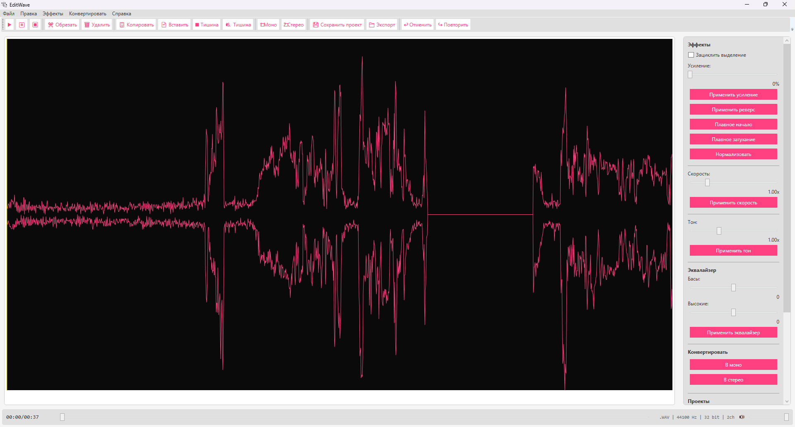
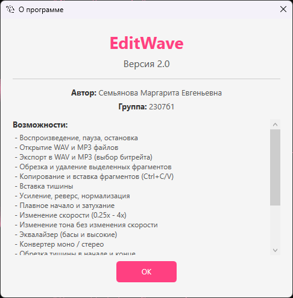

# EditWave

[](LICENSE)

Десктопный аудиоредактор на C# / WPF для обработки звука.

## Стек

- **C# / .NET 8** — WPF приложение
- **NAudio** — воспроизведение и обработка аудио
- **NAudio.MediaFoundation** — экспорт в MP3
- **LiteDB** — хранение проектов

## Возможности

### Файлы
- Открытие WAV и MP3 файлов
- Экспорт в WAV и MP3 (выбор битрейта)
- Сохранение и загрузка проектов (LiteDB)
- Перетаскивание файлов в окно (Drag & Drop)

### Правка
- Обрезка и удаление выделенных фрагментов
- Копирование и вставка фрагментов (Ctrl+C / Ctrl+V)
- Вставка тишины
- Обрезка тишины в начале и конце файла

### Эффекты
- Усиление (0–200%)
- Реверс
- Нормализация
- Плавное начало и затухание
- Изменение скорости (0.25x–4x)
- Изменение тона без изменения скорости
- Эквалайзер (басы и высокие)

### Конвертер
- Моно → стерео
- Стерео → моно

### Воспроизведение
- Play / Pause / Stop
- Зацикленное воспроизведение выделения

### Прочее
- Отмена и повтор (Ctrl+Z / Ctrl+Y)
- Визуализация волновой формы
- Горячие клавиши
- Русский интерфейс

## Скриншоты




## Запуск

1. Клонировать репозиторий
2. Открыть `EditWave.sln` в Visual Studio
3. Запустить

## Структура

```
EditWave/
├── Abstractions/       # Интерфейсы (IAudioEngine, IAudioEditor, IFileExporter и др.)
├── Models/             # Модель данных (Project)
├── ViewModels/         # ViewModel (MVVM)
├── Views/              # XAML представления
├── Services/           # Реализации (AudioEngine, AudioEditor, AudioExporter, Effects, UndoManager)
```

## Горячие клавиши

| Комбинация | Действие |
|---|---|
| Ctrl+O | Открыть файл |
| Ctrl+S | Сохранить проект |
| Ctrl+E | Экспорт |
| Ctrl+T | Обрезать |
| Del | Удалить выделение |
| Ctrl+C | Копировать |
| Ctrl+V | Вставить |
| Ctrl+Z | Отменить |
| Ctrl+Y | Повторить |
| Ctrl+G | Усиление |
| Ctrl+R | Реверс |
| ← / → | Перемотка ±5 сек |
| F1 | О программе |
